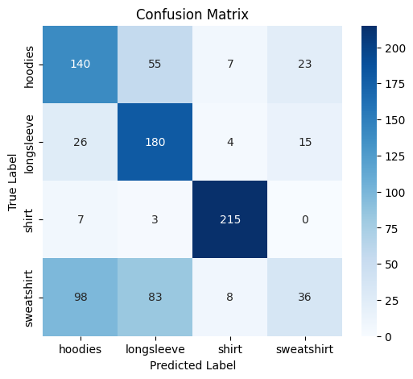
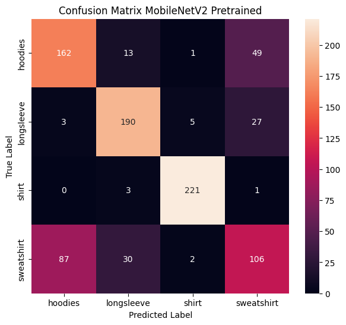
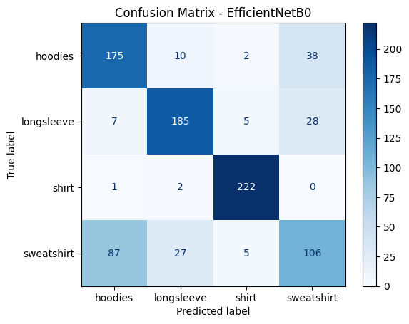
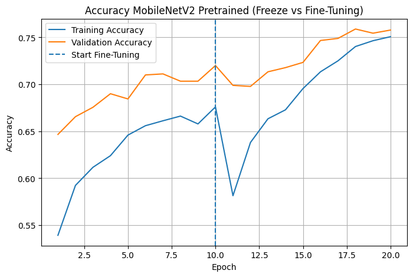
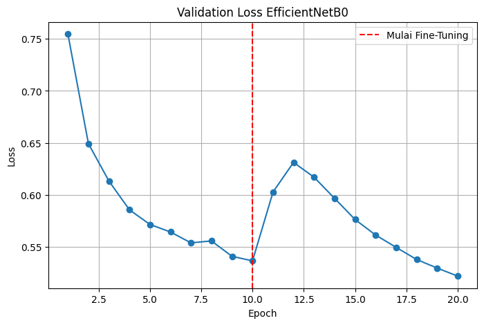
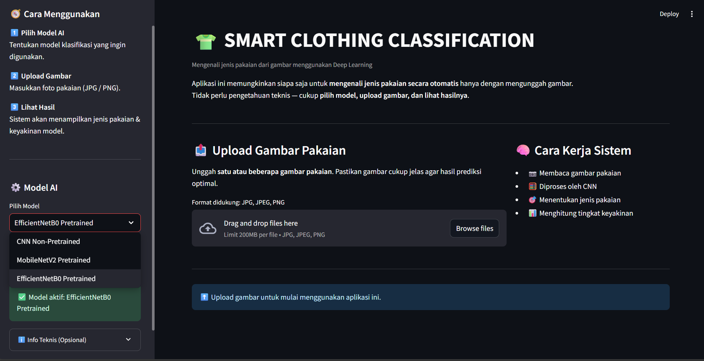
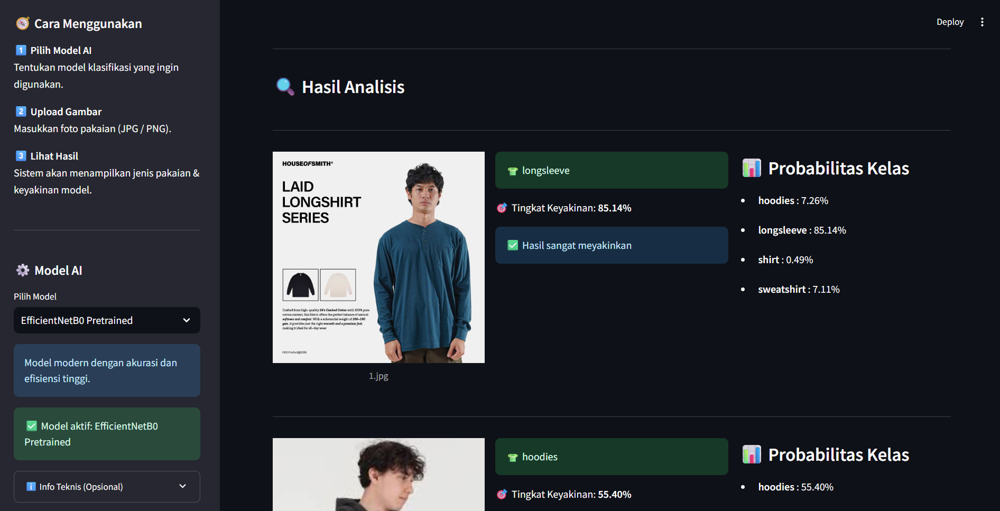

# 🧥 Klasifikasi Citra Jenis Pakaian  
### Menggunakan Pendekatan Machine Learning

---

## 📌 Deskripsi Proyek

Proyek ini mengembangkan sistem **klasifikasi citra jenis pakaian** berbasis *machine learning* untuk mengenali dan mengelompokkan kategori pakaian secara otomatis dari citra digital. Sistem dibangun menggunakan pendekatan **Convolutional Neural Network (CNN)** dengan membandingkan model yang dilatih dari awal (*non-pretrained*) dan model *pretrained* berbasis **transfer learning**.

Model utama yang digunakan meliputi **CNN non-pretrained** sebagai model dasar, serta dua arsitektur *pretrained* yaitu **MobileNetV2** dan **EfficientNetB0**. Seluruh model diterapkan pada citra produk fashion dari platform e-commerce yang memiliki karakteristik *real-world images*, sehingga sistem diharapkan mampu bekerja secara representatif pada kondisi penggunaan nyata.

---

## 🎯 Tujuan Proyek

Tujuan dari proyek ini adalah membangun sistem **klasifikasi citra jenis pakaian** yang mampu mengenali kategori pakaian secara otomatis dari gambar digital. Sistem ini ditujukan untuk mendukung kebutuhan teknologi modern seperti **e-commerce**, **pengelolaan katalog produk**, dan **sistem rekomendasi berbasis visual**, serta menjadi fondasi pengembangan aplikasi *computer vision* yang membutuhkan efisiensi dan akurasi dalam pemrosesan citra.

---

## 📂 Dataset yang Digunakan

Dataset yang digunakan dalam proyek ini adalah **Zalando Store Crawl Dataset**, yang diperoleh dari platform Kaggle.

- **Nama Dataset** : Zalando Store Crawl  
- **Sumber** : Kaggle  
- **Link Dataset** :  
  https://www.kaggle.com/datasets/dqmonn/zalando-store-crawl  

### 📊 Karakteristik Dataset

- **Jenis data** : Citra (image) pakaian  
- **Format gambar** : RGB  
- **Domain** : Fashion / Clothing  
- **Sumber gambar** : Produk fashion dari situs e-commerce Zalando  
- **Kondisi gambar** : *Real-world product images*  
- **Tujuan penggunaan** : Klasifikasi jenis pakaian  

---

## 🗂️ Struktur dan Seleksi Dataset

Dataset asli memiliki beberapa kelas dan variasi jumlah gambar per kelas.  
Dalam proyek ini dilakukan **seleksi dan penyederhanaan dataset** dengan ketentuan sebagai berikut:

### 📌 Kelas yang Digunakan

- Hoodies  
- Longsleeve  
- Shirt  
- Sweatshirt  

Kelas yang bersifat spesifik gender (*female*) **tidak digunakan** untuk menjaga konsistensi label dan menghindari bias dalam proses klasifikasi.

---

## 📊 Sampling Dataset

Untuk menjaga **keseimbangan data antar kelas**, dilakukan proses **sampling** dengan ketentuan:

- Setiap kelas diambil sebanyak **1.500 gambar**
- Pemilihan gambar dilakukan secara acak
- Total dataset yang digunakan:  
  **4 kelas × 1.500 gambar = 6.000 gambar**

---

## ⚙️ Preprocessing dan Pembagian Dataset

### 🔀 Pembagian Dataset (Train, Validation, Test)

Dataset dibagi ke dalam tiga subset dengan rasio sebagai berikut:

- **Training** : 70% (1.050 gambar per kelas)  
- **Validation** : 15% (225 gambar per kelas)  
- **Testing** : 15% (225 gambar per kelas)  

---

### 🖼️ Preprocessing Citra

Proses preprocessing citra dilakukan dengan menyesuaikan jenis model yang digunakan, yaitu antara **model CNN non-pretrained** dan **model pretrained berbasis transfer learning**.

#### 🔹 Preprocessing untuk CNN Non-Pretrained

Pada model CNN yang dilatih dari awal, preprocessing citra dilakukan menggunakan `ImageDataGenerator` dari TensorFlow/Keras dengan tahapan berikut:

- Resize gambar ke ukuran **224 × 224 piksel**
- Normalisasi nilai piksel ke rentang **[0, 1]**
- Label dikodekan dalam format **categorical**

Selain itu, diterapkan **augmentasi data** pada data training untuk meningkatkan kemampuan generalisasi model, meliputi:
- Rotasi gambar  
- Perubahan posisi horizontal dan vertikal  
- Zoom in/out  
- Horizontal flip  

Augmentasi **hanya diterapkan pada data training**, sedangkan data validation dan test hanya melalui proses normalisasi tanpa augmentasi.

---

#### 🔹 Preprocessing untuk Model Transfer Learning

Pada model pretrained, preprocessing citra disesuaikan dengan fungsi preprocessing bawaan dari masing-masing arsitektur. Sebagai contoh:

- **MobileNetV2** memetakan nilai piksel ke rentang **[-1, 1]**
- **EfficientNetB0** menggunakan skema normalisasi dan scaling khusus sesuai standar ImageNet

Pendekatan ini diimplementasikan menggunakan fungsi `preprocess_input` dari TensorFlow/Keras untuk memastikan kesesuaian distribusi data dengan proses pretraining.

---

### 🏷️ Mapping Kelas

Label kelas dihasilkan secara otomatis berdasarkan struktur folder dataset.  
Mapping kelas disimpan dalam format **JSON** untuk menjaga konsistensi label antara proses pelatihan dan implementasi sistem.

---

## 🧠 Model yang Digunakan

Proyek ini menggunakan tiga model *deep learning* untuk klasifikasi citra jenis pakaian:

- **CNN Non-Pretrained**  
  Model CNN yang dilatih dari awal tanpa bobot pretrained dan digunakan sebagai **baseline**.

- **MobileNetV2**  
  Model pretrained yang ringan dan efisien dengan pendekatan **transfer learning**.

- **EfficientNetB0**  
  Model pretrained dengan arsitektur modern yang dioptimalkan untuk keseimbangan akurasi dan kompleksitas model.

---

## 📈 Hasil dan Analisis

### 📊 Tabel Perbandingan Performa Model

| Model | Accuracy | Precision (Avg) | Recall (Avg) | F1-Score (Avg) |
|------|----------|------------------|--------------|----------------|
| CNN Non-Pretrained | 0.63 | 0.62 | 0.63 | 0.60 |
| MobileNetV2 (Pretrained) | 0.75 | 0.75 | 0.75 | 0.75 |
| **EfficientNetB0 (Pretrained)** | **0.76** | **0.76** | **0.76** | **0.76** |

---

### 🖼️ Visualisasi Model Performa

#### Confusion Matrix 🔴🟢
Visualisasi Confusion Matrix untuk masing-masing model:

| CNN Non-Pretrained | MobileNetV2 | EfficientNetB0 |
|-------------------|-------------|----------------|
|  |  |  |

---

#### Learning Curves 📈
Visualisasi proses pelatihan (loss dan accuracy):

| CNN Non-Pretrained | MobileNetV2 | EfficientNetB0 |
|-------------------|-------------|----------------|
|  |  |  |

---

## 🖥️ Implementasi Dashboard Streamlit

Sistem klasifikasi ini diimplementasikan ke dalam dashboard interaktif menggunakan **Streamlit**.

### 🖼️ Antarmuka Dashboard

| Tampilan Utama Dashboard | Hasil Analisis Prediksi |
|--------------------------|-------------------------|
|  |  |

---

### 🛠️ Cara Kerja Sistem

1. Menerima input **gambar pakaian** dari pengguna  
2. Gambar diproses oleh **model AI** yang dipilih di sidebar  
3. Sistem mengklasifikasikan gambar ke dalam **4 kategori pakaian**  
4. Menampilkan **hasil prediksi dan tingkat keyakinan (confidence)**  

---

## ⚙️ Panduan Menjalankan Sistem Secara Lokal

Ikuti langkah-langkah berikut untuk menjalankan sistem di lingkungan lokal Anda:

**1. Kloning Repository**
Gunakan perintah berikut di terminal:
`git clone https://github.com/Mochdioanugrah/KLASIFIKASI-CITRA-JENIS-PAKAIAN.git`
`cd KLASIFIKASI-CITRA-JENIS-PAKAIAN`

**2. Instalasi Dependensi**
Pastikan Python sudah terinstal, lalu jalankan perintah:
`pip install -r requirements.txt`

**3. Menjalankan Aplikasi**
Mulai server dashboard dengan perintah:
`streamlit run app.py`

---

## 🌐 Live Demo Aplikasi
Anda dapat mencoba sistem klasifikasi pakaian ini secara langsung melalui tautan publik berikut:

👉 [**Akses Live Demo Proyek Di Sini**](https://smart-clothing-classification.streamlit.app/)

---

## 👤 Biodata Pengembang

* **Nama**: Moch Dio Anugrah U
* **NIM**: 202210370311244
* **Program Studi**: Teknik Informatika
* **Institusi**: Universitas Muhammadiyah Malang
